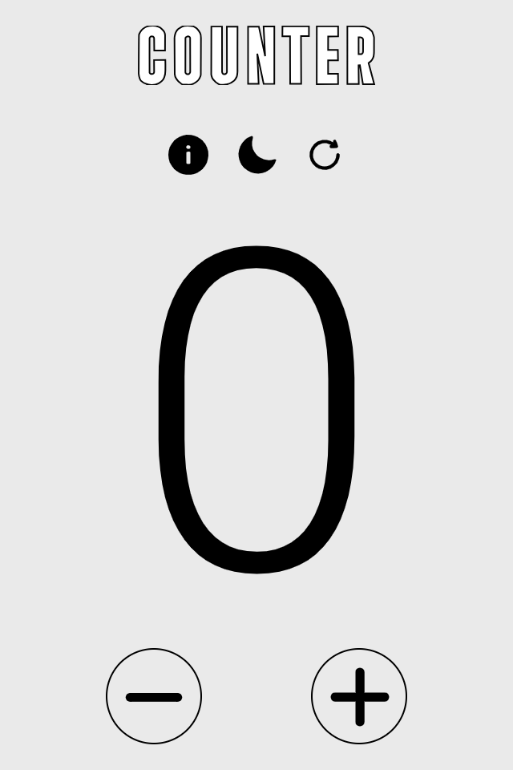

# Counter JavaScript - Start2Impact

Progetto sviluppato come parte del corso di JavaScript su [Start2Impact](https://www.start2impact.it). Questo semplice contatore interattivo consente di incrementare, decrementare e resettare un valore. È un progetto didattico che punta a consolidare le basi della manipolazione del DOM e della gestione degli eventi.

## Screenshoot

## Funzionalità

- **Incremento:** Aumenta il valore del contatore con un clic.
- **Decremento:** Diminuisce il valore del contatore con un clic.
- **Reset:** Riporta il contatore al valore iniziale.
- **Altri bottoni:** Tasto info, modalità light-dark e reset.
- **Tastiera:** Si possono usare tasto della freccia in alto e in basso per aumentare e diminuire il valore , e backspace per azzerare .

## Tecnologie Utilizzate
- **Figma**: Per realizzare la user interface.
- **Inkscape**: Per realizzare il logo.
- **HTML**: Struttura della pagina.
- **CSS**: Stile e layout del contatore.
- **Sass**: Preprocessore CSS per la gestione avanzata degli stili.
- **JavaScript**: Logica e interattività.

## Cosa ho appreso  ?

- **Manipolazione del DOM**: Come modificare dinamicamente il contenuto di una pagina web utilizzando JavaScript.
- **Manipolazione del DOM**: Rendere gli elementi  di una pagina web responsive utilizzando JavaScript.
- **SVG**: Ho capito meglio come si lavora con le svg.

## Su cosa devo lavorare ? 

- **Responsive Design**: Rendere la pagina più fluida al ridimensionamento della finestra.
- **Responsive Design**: Migliorare la mia abilità di realizzare buone UI, devo sviluppare dei principi da seguire.
- **Javascript**: Migliorare il codice javascript.
- **Software di testing**: A fine lavoro ho usato dei sofware di testing per l'accessibilità (AXE, Wave), per le prestazioni (PageSpeedInsight), per la visualizzazione (responsinator) , per html e css (w3c markup , css validation w3c) . Devo approfondire sti software , devo studiare l'accessibilità. 

## Crediti

- Font-awsome - (https://fontawesome.com/)
- Flaticon - (https://www.flaticon.com/)

## Autore 

- Instagram - [@zakaria_jamali_18](https://www.instagram.com/zakaria_jamali_18/)
