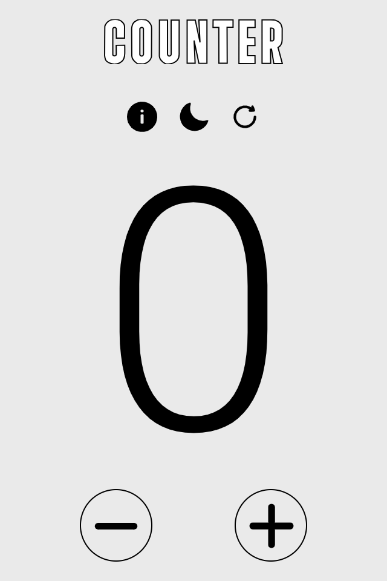

# Counter JavaScript - Start2Impact

Progetto sviluppato come parte del corso di JavaScript su [Start2Impact](https://www.start2impact.it). Questo semplice contatore interattivo consente di incrementare, decrementare e resettare un valore. È un progetto didattico che punta a consolidare le basi della manipolazione del DOM e della gestione degli eventi.

## Screenshoot

## Funzionalità

- **Incremento:** Aumenta il valore del contatore con un clic.
- **Decremento:** Diminuisce il valore del contatore con un clic.
- **Reset:** Riporta il contatore al valore iniziale.

## Tecnologie Utilizzate

- **HTML**: Struttura della pagina.
- **CSS**: Stile e layout del contatore.
- **Sass**: Preprocessore CSS per la gestione avanzata degli stili.
- **JavaScript**: Logica e interattività.

## Cosa ho appreso  ?

- **Manipolazione del DOM**: Come modificare dinamicamente il contenuto di una pagina web utilizzando JavaScript.

## Su cosa devo lavorare ? 

- **Responsive Design**: Migliorare l'interfaccia per dispositivi mobili, rendendo il contatore più accessibile su schermi di diverse dimensioni.

## Autore 

- Instagram - [@zakaria_jamali_18](https://www.instagram.com/zakaria_jamali_18/)